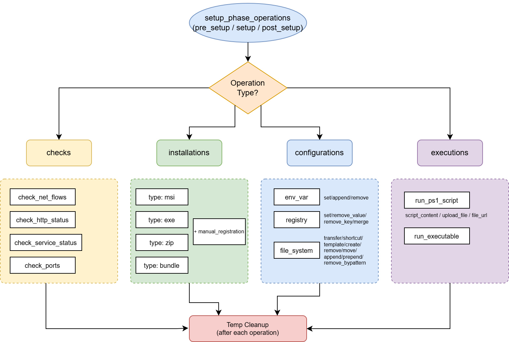
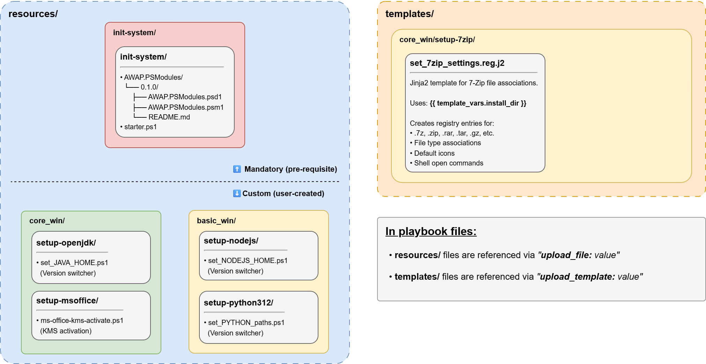
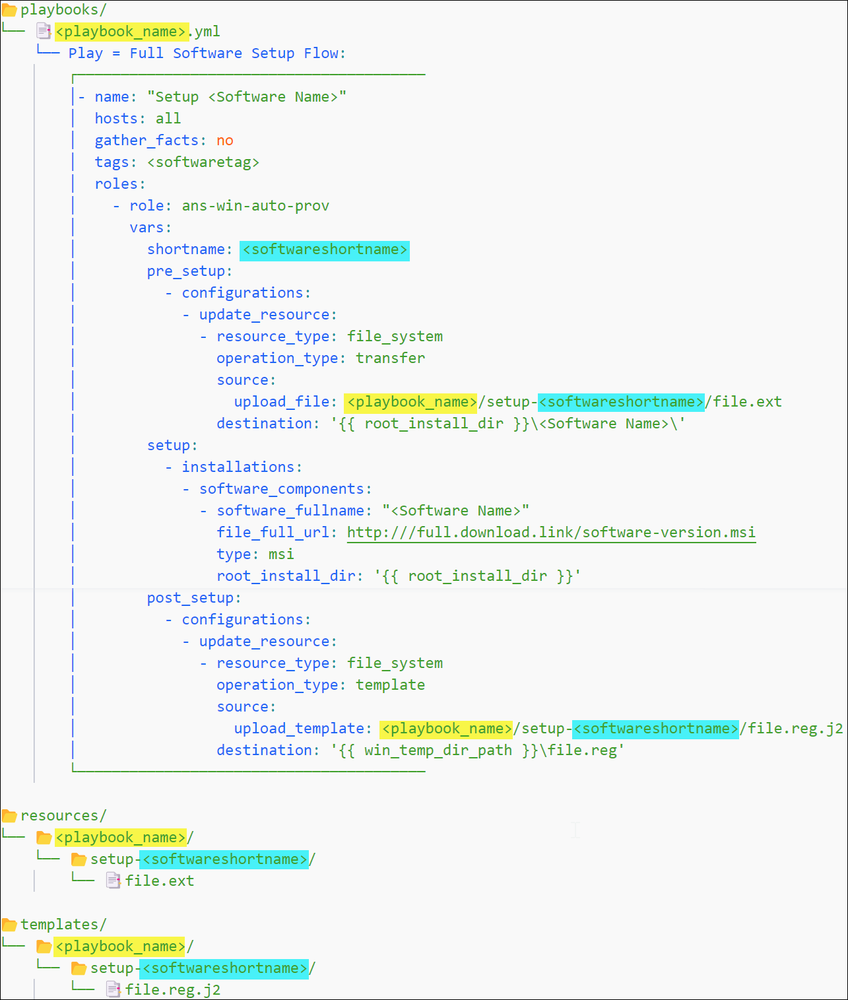

Automate the provisioning, configuration, and management of Windows environments using Ansible.

This repository provides a minimalist solution to streamline software installation, system configuration, and feature enablement for Windows systems. It deliberately avoids Chocolatey dependencies in favor of native toolings.

The repository features an opinionated Ansible Windows playbook structure, centralizing all configurable parameters at the playbook/inventory level, exposing settings for complete visibility and control.
   
**Check [`worklog.md`](worklog.md) for more details.**

## 1. Playbook Execution Flow

## 2. Role Template (`operations.yml.j2`) Decision Tree

## 3. Bundled Content Structure

## 4. Bundled Content Naming Conventions

