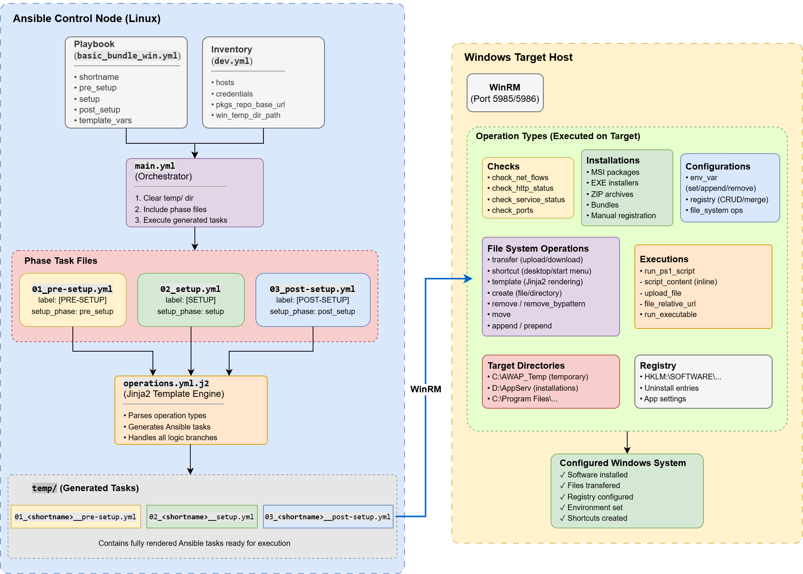

# Ansible Windows Auto-Provisioning (AWAP)


[](https://www.python.org/downloads/release/python-3115/)


**Ansible Windows Auto-Provisioning (AWAP)** is a declarative Windows provisioning framework built on Ansible, designed primarily for enterprise environments, to streamline software installation, system configuration, and feature enablement for Windows systems. 
AWAP abstracts complex Windows deployment tasks into a simple YAML-based configuration that handles software installations, system configurations, registry management, and more.

**Table of Contents:**
- [Overview](#overview)
- [Key Features](#key-features)
- [Requirements](#requirements)
    - [Ansible Control Node (Linux)](#ansible-control-node-linux)
    - [Target Windows Systems](#target-windows-systems)
- [Architecture](#architecture)
    - [Directory Structure](#directory-structure)
    - [How It Works: *Execution Flow*](#how-it-works-execution-flow)
- [Setting Up Test Environment](#setting-up-test-environment)
    - [Ansible Controller](#ansible-controller)
    - [Target Windows Host](#target-windows-host)
    - [\[Optional\] Simulated {KMS + Artifacts Repository} Server](#optional-simulated-kms--artifacts-repository-server)


## Overview

AWAP is a template-driven Ansible role that transforms high-level YAML declarations into executable Windows provisioning tasks. Instead of writing individual Ansible tasks for each operation, you define *what* you want in a structured YAML format, and AWAP generates the appropriate tasks at runtime.

**Philosophy:**
- **No Chocolatey dependency**: uses native installers (MSI, EXE, ZIP)
- **Centralized configuration**: all parameters defined in playbook variables
- **Explicit over implicit**: every setting is visible and configurable
- **Template-driven**: Jinja2 templates generate tasks dynamically


## Key Features

| Feature | Description |
|---------|-------------|
| **Multi-format Installation** | MSI, EXE, ZIP archives, and installation bundles |
| **Registry Management** | CRUD operations, .reg file merging, key/value manipulation |
| **Environment Variables** | Set, append, remove system-level environment variables |
| **File Operations** | Transfer, create, remove, move, template rendering, append/prepend |
| **Desktop Shortcuts** | Create shortcuts with custom icons in desktop or Start Menu |
| **PowerShell Execution** | Run inline scripts or uploaded .ps1 files |
| **Pre-flight Checks** | Network flow, HTTP status, service status, port availability |
| **Idempotent Operations** | Checks existing state before making changes |


## Requirements

### Ansible Control Node (Linux)

- Rocky Linux 8.x / RHEL 8.x / AlmaLinux 8.x (or equivalent)
- Python 3.6+ with `pywinrm>=0.4.3`
- `ansible-core` 2.15+ (tested with 2.18.1)
- Ansible collections: `ansible.windows:==2.2.0`, `community.windows:==2.1.0` and `ansible.posix:==1.5.4`

### Target Windows Systems

- Windows Server 2016, 2019, or 2022
- PowerShell 5.1+
- WinRM enabled (HTTP:5985 or HTTPS:5986)


## Architecture

### Directory Structure

```
.
├── 📂inventories/📂environments/			# Target host definitions
├── 📂playbooks/
│   ├── basic_win.yml						# Basic software bundle setup (L2)
│   ├── core_win.yml						# Core software bundle setup (L1)
│   └── 📂roles/📂ans-win-auto-prov/		# The core role
│       ├── 📂tasks/
│       │   ├── main.yml					# Orchestrator
│       │   ├── 01_pre-setup.yml			# Pre-setup phase
│       │   ├── 02_setup.yml				# Main setup phase
│       │   ├── 03_post-setup.yml			# Post-setup phase
│       │   └── templates/operations.yml.j2	# Task generator
│       └── 📂temp/							# Generated task files
├── 📂resources/							# Files to deploy
│   ├── init-system/						# System initialization (PS modules, starter)
│   ├── core_win/							# Core bundle resources
│   └── basic_win/							# Basic bundle resources
├── 📂templates/							# Jinja2 templates of files to deploy
├── 📂vaults/📂environments/				# Encrypted credentials
├── 📂tools/								# Utility scripts (not called by playbooks)
│
├── 🗂️docs/				                 # Documentation
└── 🗂️scripts/								 # Scripts for setting up the environment
```

### How It Works: *Execution Flow*

```
Playbook Variables ──► Phase Files ──► operations.yml.j2 ──► Generated Tasks ──► WinRM ──► Windows
    (pre_setup)         (01_*.yml)      (Jinja2 template)     (temp/*.yml)               (target)
    (setup)             (02_*.yml)
    (post_setup)        (03_*.yml)
```



1. You define operations in playbook variables (`pre_setup`, `setup`, `post_setup`)
2. Phase files include `operations.yml.j2` with your operation list
3. The Jinja2 template generates native Ansible tasks
4. Generated tasks execute on Windows targets

## Setting Up Test Environment
### 1. Ansible Controller

> **Check [`./scripts/`](scripts/) directory**

On a **Rocky Linux 8.9 x64** VM:

```bash
sudo dnf install -y python3.11 python3.11-pip
pip3 install ansible-core==2.16.1
pip3 install pywinrm==0.4.3
ansible-galaxy collection install ansible.windows:==2.2.0 community.windows:==2.1.0 ansible.posix:==1.5.4
```

### 2. Target Windows Host

On a **Windows Server 2019 Standard** VM, run [`scripts/setup_target-WinSvr2019.ps1`](scripts/setup_target-WinSvr2019.ps1)

Then, to test from the Ansible Controller:

1. [`python3 scripts/ansible_ctrl_test_winrm_http.py`](scripts/ansible_ctrl_test_winrm_http.py)
2. [`python3 scripts/ansible_ctrl_test_winrm_https.py`](scripts/ansible_ctrl_test_winrm_https.py)
3. Ansible *ping* test:

    ```bash
    ansible -v win2019-http -i inventories/environments/dev.yml -m win_ping
    ansible -v win2019-https -i inventories/environments/dev.yml -m win_ping
    ```

### 3. [Optional] Simulated {KMS + Artifacts Repository} Server

You can setup a simulated KMS ([`vlmcsd`](https://github.com/Wind4/vlmcsd)) and Artifacts Repository (NGINX + [Filebrowser](https://github.com/filebrowser/filebrowser)) if you want to test MS Office installation and activation, as well as downloading installer files from a private server (e.g. company's JFrog Artifactory).

For that, you can run [`scripts/setup_kms_artifactory_simul_svr.sh`](scripts/setup_kms_artifactory_simul_svr.sh) on a dedicated third VM.
