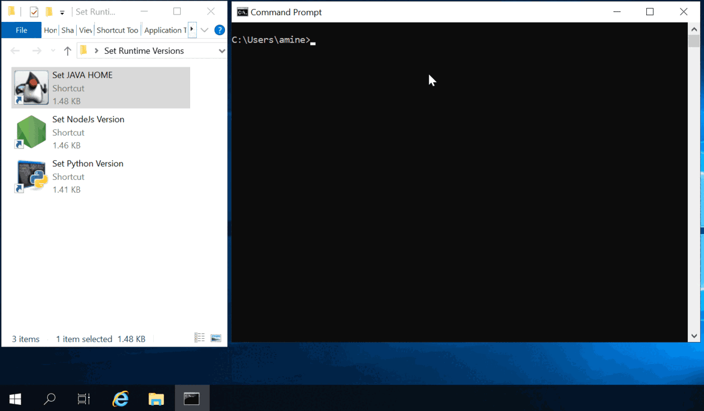

# Work Log

## 2024-03-29

- Add script/doc to setup a simulated {KMS + Artifacts Repository} server on a single VM.

## 2024-03-22 [(code)](https://github.com/amindeed/Ansible-Win-AutoProvisioning/tree/e704cfe49fceb6cb3fbebb0e2b18821b9326d63d)

- Update README and repo with information and scripts to setup testing environment.

## 2024-03-14 [(code)](https://github.com/amindeed/Ansible-Win-AutoProvisioning/tree/a6d60aa158175383a8291260681a9a70e97f110b)

- Started new README layout and content.
- Uploaded updated version ofr the architecture diagram (Draw.io)

## 2024-03-11 [(code)](https://github.com/amindeed/Ansible-Win-AutoProvisioning/tree/4847bd86e0a498df230ce3a150e95a945f2e8bfb)

- Added architecture diagrams (check `README.md` and `assets/`). Updated README.
- Completed updating `worklog.md` with older entries.

## 2024-03-03 [(code)](https://github.com/amindeed/Ansible-Win-AutoProvisioning/tree/4e04e416ffb417bc54a7a4deb149d61a76bbc037)

- Reverted back to simple environment variables propagation/update task (in `operations.yml.j2`)
- Significant update of `worklog.md` (added old entries. Still in progress, but almost complete: particularly highlighting how project's architecture has evolved.


## 2024-02-28 [(code)](https://github.com/amindeed/Ansible-Win-AutoProvisioning/tree/6ad961ccc680fdc3215aed49118bc84a6a9214e0)

- Replaced hard-coded paths values with variables in playbooks files.
- `base_win.yml`: simplified Cygwin setup (⚠️ requires public internet connection)
- `operations.yml.j2`:
    - Revised environment variables broadcast/propagation: handling possible errors/failures, as variables are not set right away (still needs to logoff/re-login).
- Starter and runtime selection scripts: updated with better code to prevent execution by Admins.


## 2024-02-21 [(code)](https://github.com/amindeed/Ansible-Win-AutoProvisioning/tree/95aae5e1037d7f5f5690ae270000c264e3b75eeb)

- Simplified runtimes setups (Java, Python, NodeJS) across playbooks.
- Minor updates to `operations.yml.j2` and playbooks to better handle problematic variable values: `D:` ➔ `D:\`, unintentional invalid escapes, values containing `%`...
- Enhanced runtime selection script tools with improved handling of appending to the current user's PATH variable.
- Added helper function to test if paths exist, to Init. System's PowerShell module (`AWAP.PSModules.psm1`)
- Added code to Init. System's starter script to prevent execution by Admins (this mitigates the risk of accidentally setting system-wide environment variables like `%JAVA_HOME%`).


## 2024-02-20 [(code)](https://github.com/amindeed/Ansible-Win-AutoProvisioning/tree/23850bae218f63def2542b549ed49810e0a04b9f)

- Cleaned up repository's content and structure.
- Add explanations/instructions as comments to playbook files.
- Minor updates to `operations.yml.j2` to reflect changes applied to repository's structure: `{{ uploads_dir }}` ➔ `{{ resources_dir }}`


## 2024-01-20 [(code)](https://github.com/amindeed/Ansible-Win-AutoProvisioning/tree/4d881e3d1b551674468e0c82b312d1ad19a80e00)

- Successfully switched to MS Office 2016 x64 (installation + activation)
- Debugging environment variables broadcast mechanism (still requires user's logoff/logon in some cases). 
- Revised the logic of automatic/default environment variables setting for Java, Python and NodeJS (no more setting at startup).
- `initsys` tag/play is now always executed (as a prerequisite), unless explicitely excluded with `--skip-tags "initsys"`. 
- Added backup host to DEV inventory.


## 2024-01-15 [(code)](https://github.com/amindeed/Ansible-Win-AutoProvisioning/tree/ce94d89f192e80146ea896a11b5f49469078f461)

- Update `worklog.md` with older entries.
- Minor changes/fixes in playbook files (core and basic)
- A few testing rounds (filtering with tags, profiling on/off...).
- Preparing for MS Office 2016 setup test.


## 2024-01-09 [(code)](https://github.com/amindeed/Ansible-Win-AutoProvisioning/tree/2b5555b73307eea55f2cf5d486d91f9a6b09d6a2)

- Refined Core playbook (`playbooks/core_bundle_win.yml`): removed a couple of Notepad++ plugins.
- Some restructuring, testing (with upgraded collections: `ansible.windows:==2.2.0` and `community.windows:==2.1.0`).

## 2024-01-01 [(code)](https://github.com/amindeed/Ansible-Win-AutoProvisioning/tree/6c2d609a4ea50819ff6c2ee32f80fb6a9de02763)

- Fixed template task file creation to work during Ansible's dry-run (`--check`) mode.


## 2023-12-10 [(code)](https://github.com/amindeed/Ansible-Win-AutoProvisioning/tree/c141c032b4e464e5a4d336b2ede662f1cf0a6170)

- Added project `README.md`.
- Updated Dev inventory with HTTPS settings.


## 2023-12-06: ***🚩 Finalized Feature Architecture*** [(code)](https://github.com/amindeed/Ansible-Win-AutoProvisioning/tree/312933e93567c09d6012174ce175ea79cd4bfe28)

- Preparation for Ansible upgrade to version 2.16.1.
- Simplified `operations.yml.j2` template (reduced ~145 lines).

```
operations.yml.j2
│
├── CHECKS
│   ├── check_net_flows      (TCP connection test)
│   ├── check_http_status    (HTTP endpoint test)
│   ├── check_service_status (Windows service query)
│   └── check_ports          (TCP/UDP port listener)
│
├── INSTALLATIONS
│   ├── Downloads (from HTTP source)
│   ├── Uploads (from Ansible controller)
│   ├── Install MSI
│   ├── Install EXE
│   ├── Install ZIP
│   └── Install Bundle
│
├── CONFIGURATIONS
│   ├── Environment Variables (create/update/delete)
│   ├── Registry Keys
│   │   ├── Add/Update keys & values
│   │   ├── Delete values
│   │   ├── Delete keys
│   │   └── Merge .reg files
│   └── File System
│       ├── Create files/directories
│       ├── Copy/Move
│       ├── Remove by pattern
│       └── Desktop shortcuts
│
└── EXECUTIONS
    ├── run_ps1_script (uploaded)
    └── run_exec (win_shell inline/block)
```


## 2023-12-05 [(code)](https://github.com/amindeed/Ansible-Win-AutoProvisioning/tree/25d6924da26ffdedaf48f2506557fbdb4fe65eab)

- Added cleanup tasks for downloaded/uploaded files after installation.
- Enhanced `operations.yml.j2` template (+35 lines).


## 2023-12-04 [(code)](https://github.com/amindeed/Ansible-Win-AutoProvisioning/tree/b8f8323e6caa83869643192bd6c098c2ca967498)

- Updated `operations.yml.j2`.
- Playbooks adjustments: `basic_bundle.yml` → `basic_bundle_win.yml`, `core_bundle.yml` → `core_bundle_win.yml`.
- Reorganized templates: `uploads/bundles/core` → `uploads/bundles/core_win`.
- Added option to create desktop shortcuts in subdirectories.
- Expanded `demo_playbook.yml` with examples (user notifications via `community.windows.win_msg`).


## 2023-12-02 [(code)](https://github.com/amindeed/Ansible-Win-AutoProvisioning/tree/ca858ff3ce105bb7225295d177626cdb0dd285cd)

- Significant enhancements to playbooks and role template structure.
- `operations.yml.j2` updated.
- Renamed `_role-template_` to `ans-win-auto-prov`.
- Created `tools/clear_role_temp.sh` for cleaning up temporary role files.
- Removed `_role-template_/temp/defaul.yml`.


## 2023-12-01 [(code)](https://github.com/amindeed/Ansible-Win-AutoProvisioning/tree/2789e9fededf018a3f20577594b8c745470e7f0e)

- Added filesystem operation feature: `remove_bypattern` (allows removal of files matching a pattern).
- Testing registry file templates and merging with existing `.reg` files.
- **Added 7-Zip settings registry template** (`templates/bundles/core/setup-7zip/set_7zip_settings.reg.j2`): complete file associations for all supported archive formats (.7z, .rar, .zip, .tar, .gz, .bz2, .cab, .iso, etc.).
- Reorganized `uploads/` directory structure into `uploads/bundles/basic/` and `uploads/bundles/core/`.
- Added `vaults/README.md`.
- Enhanced `demo_playbook.yml`.
- Removed test registry file from `uploads/test/`.


## 2023-11-29 [(code)](https://github.com/amindeed/Ansible-Win-AutoProvisioning/tree/25a0e7082824c4c07febdb57d87707bf6ae4e5ff)

- **Completed all Windows Registry update features:**
    - Create/update registry keys and values.
    - Import registry files.
    - Merge registry content with existing files.
- Added sample registry test file (`uploads/test/test_reg_uploaded.reg`).


## 2023-11-28 [(code)](https://github.com/amindeed/Ansible-Win-AutoProvisioning/tree/1e11ccf1865a7b999c87140d4d9c2779fab2e076)

- Almost done with Registry update feature; only registry file merge left to implement.
- Final refinements to 'envvar update' refactoring.
- Enhanced 'ports check' feature implementation.


## 2023-11-27 [(code)](https://github.com/amindeed/Ansible-Win-AutoProvisioning/tree/5537013596c9c40251705564f4f607f47f1ddc9e)

- Updated role task files (`01_pre-setup.yml`, `02_setup.yml`, `03_post-setup.yml`).
- Updated `core_bundle.yml` (key addition: example code for Windows Registry operations).
- Significant update of `operations.yml.j2`.


## 2023-11-26 [(code)](https://github.com/amindeed/Ansible-Win-AutoProvisioning/tree/0ffd9d9ef44956f724d00eb2b802f24984907542)

- Refactored environment variable update code.
- **Implemented checks features:**
    - `check_http_status`: HTTP connection check with configurable redirect handling.
    - `check_service_status`: Windows service status query using `ansible.windows.win_service_info`.
    - `check_ports`: TCP/UDP port status using `community.windows.win_listen_ports_facts`.


## 2023-11-20 [(code)](https://github.com/amindeed/Ansible-Win-AutoProvisioning/tree/758924b15527337d82cbd9726d177e4a2c2d3431)

- First working example for `run_exec` with code block (multi-line PowerShell execution).
- Updated role generation scripts.


## 2023-11-19 [(code)](https://github.com/amindeed/Ansible-Win-AutoProvisioning/tree/3b7d73cc74769f1de0c6ac22d67b747e785a7511)

- Added examples to `core_bundle.yml`.
- Enhanced `operations.yml.j2`, notably: *Refactored `run_ps1_script` code block to support file uploads*.
- Added PowerShell scripts for software setup:

    <br /><br />

    - `ms-office-kms-activate.ps1`: MS Office KMS activation with status check and server configuration.
    - `set_NODEJS_HOME.ps1` / `check_NODEJS_HOME.ps1`: Node.js version selector with GUI (supports v14, v16, v18).
    - `set_JAVA_HOME.ps1` / `check_JAVA_HOME.ps1`: Java environment configuration.
    - `set_PYTHON_paths.ps1` / `check_PYTHON_paths.ps1`: Python 3.12 path configuration.
- Reorganized AWAP.PSModules directory structure.
- Minor fix in `ansible.cfg`.


## 2023-11-17 [(code)](https://github.com/amindeed/Ansible-Win-AutoProvisioning/tree/0c5de09e24930943fb93ff295fe4ca78a8ab3005)

- Moved `AWAP.PSModules` and `starter.ps1` from `tools/` to `uploads/`.
- Enhanced `operations.yml.j2` template.


## 2023-11-15 [(code)](https://github.com/amindeed/Ansible-Win-AutoProvisioning/tree/e5c18261843fc05dad3f24e5852f206f367d0b77)

- Removed duplicate role template structure from `playbooks/roles/`.
- Removed `finalize-system_basic` role.
- **Enhanced `AWAP.PSModules`:** Added `Update-EnvironmentVariables` function that uses Win32 `SendMessageTimeout` to broadcast environment changes system-wide without requiring a reboot.


## 2023-11-13 [(code)](https://github.com/amindeed/Ansible-Win-AutoProvisioning/tree/9e37bfd5bd0b528aad8ea99b1135812ae0adc9fc)

- Major restructuring of roles.
- Re-added `_role-template_` and `finalize-system_basic` roles with full template structure.
- Updated role generation scripts.
- Removed old PowerShell scripts from `uploads/` (consolidated into new structure).


## 2023-11-09 [(code)](https://github.com/amindeed/Ansible-Win-AutoProvisioning/tree/1ea6a2bd8d5626cf305404398965660f4131557d)

- Significant expansion of `basic_bundle.yml` (+290 lines) and `core_bundle.yml`.
- Removed `finalize-system` role (consolidated functionality).
- Updated role generation and deletion scripts.

## 2023-11-07

- Enhanced Node.js installation to properly set `NODEJS_HOME` environment variable ([`affae3c`](https://github.com/amindeed/Ansible-Win-AutoProvisioning/tree/affae3c95cc61d786ff167985a83c39cab6fbe3b)).
- Removed `EXEC__set_NODEJS_HOME.vbs` (replaced with PowerShell-based solution).
- Added `finalize-system` role with:
    - PATH environment variable setup.
    - `starter.ps1` for post-installation tasks.
- Added `set_JAVA_HOME.ps1` PowerShell script ([`ccbb2cb`](https://github.com/amindeed/Ansible-Win-AutoProvisioning/tree/ccbb2cb648a671780f0114a4360acf34fd081226)).


## 2023-11-05

- Added support for checking installed software.
- Enhanced `core_bundle.yml` with additional software configurations.


## 2023-11-02 [(code)](https://github.com/amindeed/Ansible-Win-AutoProvisioning/tree/8ae89672bcbdfe9dee8f9d665294ed6b9df72ef2)

- Resolved Ansible version compatibility issues.
- Major cleanup: Removed 185 generated role files (consolidating to dynamic template generation).
- Kept only essential role templates.


## 2023-11-01 [(code)](https://github.com/amindeed/Ansible-Win-AutoProvisioning/tree/a5918b418200b569927e0f13af3ebad95b2e246a)

- Restored `ansible.cfg` configuration.
- Generated all software installation roles from templates:
    - 7-Zip, Adobe Reader, Beyond Compare, Dependency Walker, Draw.io, Firefox, Greenshot, KDiff3, KeePass, Keystore Explorer, MarkText, MS Office, Notepad++, OpenSSL, Pandoc, Regshot, Sysinternals, TreeSize, VS Code.
- Added `init-system` role for initial system setup.


## 2023-10-23 [(code)](https://github.com/amindeed/Ansible-Win-AutoProvisioning/tree/323f1f654ed9523e61fefa0a74474dcc56ef4c39)

- Removed authentication requirement check for file downloads (simplified approach).
- Created `AWAP.Modules` PowerShell module:
    - Provides helper functions for Ansible tasks.
- Added utility scripts:
    - `EXEC_PS1_SCRIPTS.vbs`: VBScript wrapper for PowerShell execution.
    - `win_reg_str2hex.ps1`: Convert registry strings to hex format.
    - `IsAscii.ps1`, `IsBinary.ps1`: File type detection utilities.


## 2023-10-17 [(code)](https://github.com/amindeed/Ansible-Win-AutoProvisioning/tree/252b48c746be4cd60457f3c8fcd50f3e68c3d4e9)

- Added option to ignore SSL certificate checks for downloads (for internal/self-signed certificates).
- Added Windows Server 2012 development inventory (`dev_2012.yml`).
- Bundled Ansible collections locally:
    - `ansible-windows-2.1.0.tar.gz`
    - `community-windows-2.0.0.tar.gz`


## 2023-10-06 [(code)](https://github.com/amindeed/Ansible-Win-AutoProvisioning/tree/51da034400d14d589567382761e56615c4be476d)

- Created `core_bundle.yml` for "core" software installations (development tools, runtimes).
- Added many new roles:
    - Cygwin, DBeaver, Git Extensions, Maven
    - Node.js (multiple versions: 14, 16, 18)
    - OpenJDK (multiple versions: 8, 11, 17)
    - Python (versions 2 and 3)
    - UML Designer
- Enhanced `operations.yml.j2` template with additional installation methods.


## 2023-10-01: ***🚩 Consolidated Template Architecture*** [(code)](https://github.com/amindeed/Ansible-Win-AutoProvisioning/tree/a673e954b70bc2830554c77efbcf87e8e49d2a8d)

Template consolidation:
- Created unified `operations.yml.j2` template file that combines:
    - Checks (`checks.yml.j2`)
    - Configurations (`configurations.yml.j2`)
    - Executions (`executions.yml.j2`)
    - Installations (`installations.yml.j2`)
- This simplifies the template structure and makes it easier to add new operation types.
- Removed Node.js version-specific roles (14, 16, 18); will be handled dynamically.

```
playbooks/
├── main.yml          (basic software)
├── core_bundle.yml   (development tools)
└── roles/
    └── _role-template_/
        └── tasks/
            └── templates/
                └── operations.yml.j2  ← UNIFIED
                    ├── > Checks
                    ├── > Installations
                    ├── > Configurations
                    └── > Executions
```


## 2023-09-27 [(code)](https://github.com/amindeed/Ansible-Win-AutoProvisioning/tree/37e1f99e5e4c788d7c330114e846156720af531a)

- Added example MS Office `Config.xml` content in `main.yml`.
- Created roles for 20+ software packages using the template system:
    - 7-Zip, Adobe Reader, Beyond Compare, Dependency Walker, Draw.io, Firefox, Greenshot, KDiff3, KeePass, Keystore Explorer, MarkText, MS Office, Notepad++, OpenSSL, Pandoc, Regshot, Sysinternals, TreeSize, VS Code...
- Each role includes:
    - `01_pre-setup.yml`, `02_setup.yml`, `03_post-setup.yml` tasks.
    - Template files for checks, configurations, executions, and installations.


## 2023-09-26 [(code)](https://github.com/amindeed/Ansible-Win-AutoProvisioning/tree/51a9e3b8daca05c3380fe55c1f32e039405f3a84)

- Created MS Office KMS activation script (`ms-office-kms-activate.ps1`).
- Significantly enhanced Jinja2 templates:
    - `checks.yml.j2`: Pre-installation checks.
    - `configurations.yml.j2`: Post-installation configuration.
    - `executions.yml.j2`: Script execution handling.
    - `installations.yml.j2`: Software installation logic (MSI, EXE, ZIP).
- Added test playbook (`test.yml`) for template validation.
- Added sample Notepad++ plugins as test uploads.


## 2023-09-15: ***Simplified Roles Architecture*** [(code)](https://github.com/amindeed/Ansible-Win-AutoProvisioning/tree/5b48ca84cbae83470719eb81874dccddbeb36721)

Major project restructuring:
- Moved from `playbooks/bundles/core/` structure to `playbooks/roles/` (flatter, simpler).
- Created unified role template structure:
    - `_role-template_/` as the base template for all roles.
    - Tasks split into phases: `01_pre-setup.yml`, `02_setup.yml`, `03_post-setup.yml`.
- Added helper scripts: _to be used as a development convenience for regenerating roles after template changes_
    - `gen_roles.sh` - Generate new roles from template.
    - `del_roles.sh` - Delete generated roles.
- Added utility tools:
    - `activate_office.ps1` - MS Office activation helper.
    - `check_software_installed.ps1` - Verify software installation status.
- Created MS Office installation tasks with pre-setup checks and post-setup configuration.

```
├── inventories/
│   └── environments/
│       └── dev.yml
│
├── playbooks/
│   ├── main.yml
│   └── roles/
│       ├── del_roles.sh
│       ├── gen_roles.sh
│       ├── _role-template_/
│       │   ├── tasks/
│       │   │   ├── 01_pre-setup.yml
│       │   │   ├── 02_setup.yml
│       │   │   ├── 03_post-setup.yml
│       │   │   ├── main.yml
│       │   │   └── templates/
│       │   │       ├── checks.yml.j2
│       │   │       ├── configurations.yml.j2
│       │   │       ├── executions.yml.j2
│       │   │       └── installations.yml.j2
│       │   └── temp/
│       │       └── defaul.yml
│       │
│       │
│       ├── setup-vscode/      ←   Copied from `_role-template_/`
│       │   ├── tasks/
│       │   │   ├── 01_pre-setup.yml
│       │   │   ├── 02_setup.yml
│       │   │   ├── 03_post-setup.yml
│       │   │   ├── main.yml
│       │   │   └── templates/
│       │   │       ├── checks.yml.j2
│       │   │       ├── configurations.yml.j2
│       │   │       ├── executions.yml.j2
│       │   │       └── installations.yml.j2
│       │   └── temp/      ←   Content dynamically generated at runtime
│       │       ├── 01_1_setup-vscode__pre-setup_checks.yml
│       │       ├── ...
│       │       ├── 03_3_setup-vscode__post-setup_configurations.yml
│       │       ├── ...
│       │       └── defaul.yml
│       │
│       │
│       ├── setup-adobereader/
│       │   ├─ tasks/
│       │      └── ...
│       │
│       └── setup-.../
│ 
│
├── temp/
├── tools/
└── uploads/
```


## 2023-08-28: _Initial Development Sprint: **Bundle-Based Architecture**_ [(code)](https://github.com/amindeed/Ansible-Win-AutoProvisioning/tree/37e8ffb5dea7321afdbef6880913311e88df37fc)

- Initial project structure with Ansible best practices for Windows provisioning.
- Created core directory structure:
    - `inventories/environments/` - Environment-specific inventory files.
    - `playbooks/bundles/core/` - Main playbook and roles.
    - `vaults/` - Ansible Vault encrypted variables (placeholder)
- Initial roles created (one role per software component)
    - `_role-template_` - Base template for generating new roles.
    - `setup-7zip` - 7-Zip installation role.
    - `setup-keepass` - KeePass installation role.
    - `setup-openssl` - OpenSSL installation role with post-install configuration.
    - `setup-firefox__DRAFT` - Firefox installation (draft).
- Created Jinja2 templates for:
    - `installation.yml.j2` - Generic software installation tasks.
    - `configuration.yml.j2` - Post-installation configuration tasks.
- Development inventory (`dev.yml`) with WinRM connection settings.
- Standardized installs to download-based method

```
inventories/
└── environments/
    └── dev.yml

playbooks/
└── bundles/
    └── core/
        ├── group_vars/all.yml
        ├── main.yml
        └── roles/
            ├── _role-template_/
            │   └── tasks/
            │       ├── 01_pre-install.yml
            │       ├── 02_install.yml
            │       ├── 03_post-install.yml
            │       └── templates/
            │           ├── installation.yml.j2
            │           └── configuration.yml.j2
            ├── setup-7zip/
            ├── setup-keepass/
            └── setup-openssl/
```